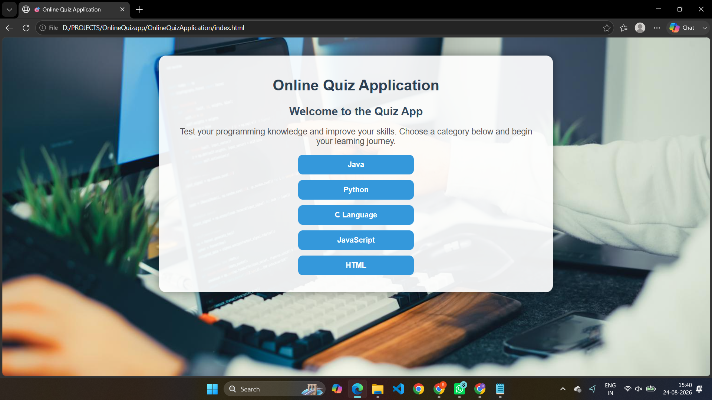
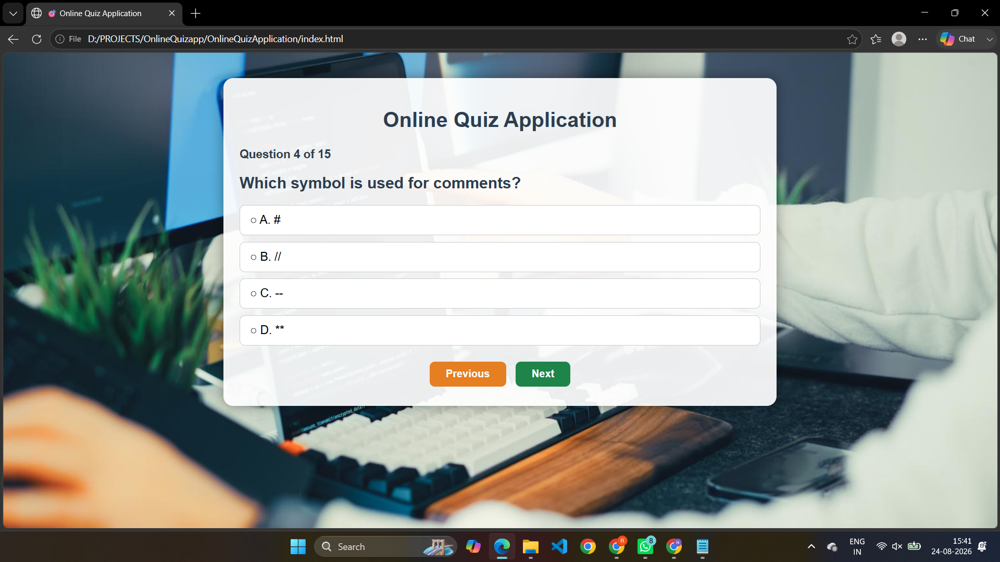
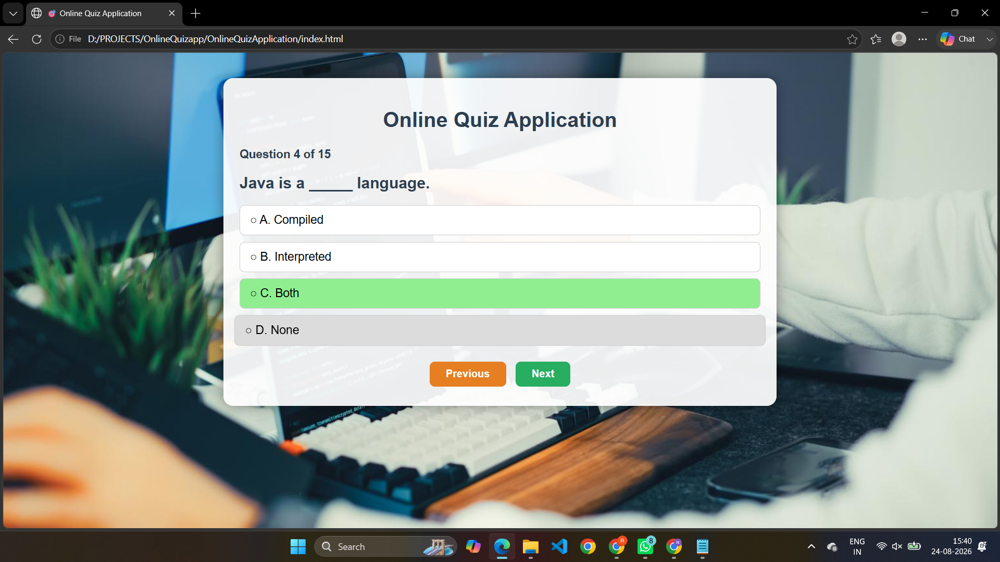

# 🎯 Online Quiz Application

### *A Sleek, Interactive & Multi-Category Web Quiz Platform*

[](https://developer.mozilla.org/en-US/docs/Web/HTML)
[](https://developer.mozilla.org/en-US/docs/Web/CSS)
[](https://developer.mozilla.org/en-US/docs/Web/JavaScript)
[](#)

---

### 🌐 [**Live Demo - Experience the Application**](https://Neelimaragolu-2004.github.io/online-quiz-application/)

*(Enable GitHub Pages in repository settings to make the live link active)*

</div>

---

## 📌 About The Project

The **Online Quiz Application** is a responsive web app built to test programming knowledge across popular core subjects. Featuring a modern **Glassmorphism UI** layered over an aesthetic background wallpaper, it offers smooth dynamic question loading, interactive answer selection states, real-time score calculation, and performance-based feedback.

---

## ✨ Highlights & Key Features

- 🎯 **Multi-Topic Selection:** Choose from 5 core technology categories (`Java`, `Python`, `C Language`, `JavaScript`, and `HTML`).
- 🧠 **Rich Question Bank:** Contains 15 structured multiple-choice questions per topic.
- 🔁 **Smart Stateful Navigation:** Move forward and backward between questions seamlessly without losing previously selected choices.
- 🎨 **Visual Selection Feedback:** Instant visual highlight (`#90EE90` green overlay) on active options.
- 🏆 **Intelligent Scoring & Feedback:** Evaluates total scores dynamically and provides motivational performance messages upon completion.
- 📱 **Clean Responsive Glassmorphic Layout:** Styled container featuring translucent backdrop overlays with responsive spacing.

---

## 📸 Screenshots Showcase

<div align="center">

| 1️⃣ Welcome & Category Selection | 2️⃣ Dynamic Quiz Interface |
| :---: | :---: |
|  |  |

| 3️⃣ Option Highlight State | 4️⃣ Score & Performance Summary |
| :---: | :---: |
|  |  |

</div>

---

## 🛠️ Tech Stack & Roles

| Technology | Usage & Implementation |
| :--- | :--- |
| 🏷️ **HTML5** | Application architecture, multi-view containers (`category-box`, `quiz-box`, `result-box`), and buttons |
| 🎨 **CSS3** | Glassmorphism container design, custom hover states, button dynamics, and fixed background setup |
| ⚡ **JavaScript (ES6)** | Question bank structure, single-page DOM manipulation, array state persistence, and score calculation engine |

---

## 📂 Project Directory Structure

```text
online-quiz-application/
│
├── 📁 Screenshots/
│   ├── QuestionScreen.png
│   ├── ResultScreen.png
│   ├── SelectedOption.png
│   └── WelcomeScreen.png
│
├── 📄 index.html        # Main HTML Markup and UI View Containers
├── 📄 style.css         # Custom Styles, UI Colors & Layout Aesthetics
├── 📄 script.js        # Dynamic Question Repository & Application Logic
├── 🖼️ back.jpg          # Background Wallpaper Image
└── 📄 README.md         # Documentation File

⚡ How to Run Locally
Clone the Repository:

Bash
git clone [https://github.com/Neelimaragolu-2004/online-quiz-application.git](https://github.com/Neelimaragolu-2004/online-quiz-application.git)

Navigate to Directory:

Bash
cd online-quiz-application

Launch Project:

Double-click index.html or open it using any standard modern browser (Chrome, Edge, Firefox, Safari).

🔄 Application Logic Workflow

┌────────────────────────┐
                │ Welcome & Category Box │
                └───────────┬────────────┘
                            │ (Select Category)
                            ▼
                ┌────────────────────────┐
                │  Initialize Array & Q1 │
                └───────────┬────────────┘
                            │
                            ▼
                ┌────────────────────────┐
                │ Render Question & Options│
                └───────────┬────────────┘
                            │ (Option Select)
                            ▼
              ┌─────────────────────────────┐
              │ Highlight Active Option Choice│
              └─────────────┬───────────────┘
                            │
             ┌──────────────┴──────────────┐
             │                             │
             ▼                             ▼
     [ Click Previous ]               [ Click Next ]
     (Show Previous Q)               (Save & Next Q)
             │                             │
             └──────────────┬──────────────┘
                                │ (On Last Question)
                                ▼
                ┌────────────────────────┐
                │ Calculate Final Score  │
                └───────────┬────────────┘
                            │
                            ▼
                ┌────────────────────────┐
                │ Display Results Screen │
                └────────────────────────┘
Key Technical Learnings
Complex Data Modeling: Structuring organized data banks using nested JavaScript objects.

Single-Page Dynamic DOM Switching: Hiding and displaying interface panels (category-box, quiz-box, result-box) without triggering page reloads.

Array-Based State Persistence: Tracking selected answers across non-linear question navigation using indexed arrays.

Responsive Visual Aesthetics: Managing backdrop filters and dynamic CSS element highlights (#90EE90) programmatically.

👩‍💻 Author & Maintainer
⭐ If you find this repository helpful, please consider giving it a Star! ⭐
